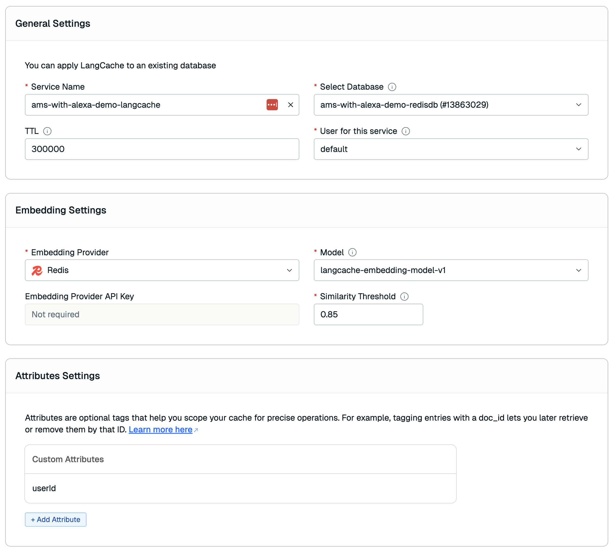

# Building my own J.A.R.V.I.S assistant

## Overview
This project demonstrates how to create a [J.A.R.V.I.S](https://en.wikipedia.org/wiki/J.A.R.V.I.S.) assistant deployed as an Alexa skill. Built using Java, LangChain4J, AWS Lambda, and Redis Cloud, it enables Alexa to recall past conversations and deliver contextual, intelligent responses. It showcases how to implement a memory and semantic-caching layer for AI assistants, enriching the natural language experience through state persistence and fast retrieval.

## Table of Contents
- [Demo Objectives](#demo-objectives)
- [Setup](#setup)
- [Running the Demo](#running-the-demo)
- [Slide Deck](#slide-deck)
- [Architecture](#architecture)
- [Known Issues](#known-issues)
- [Resources](#resources)
- [Maintainers](#maintainers)
- [License](#license)

## Demo Objectives
- Demonstrate how to implement context engineering patterns with LangChain4J.
- Demonstrate Redis Agent Memory as a memory persistence layer for AI context.
- Demonstrate Redis LangCache as a semantic cache layer for human interactions.
- Automate Alexa skill deployment using Terraform, AWS Lambda, and the ASK CLI.
- Illustrate how Redis Iris supports scalable AI use cases in need of context.

## Setup

### Dependencies
- [Java 21+](https://www.oracle.com/java/technologies/downloads)
- [Maven 3.9+](https://maven.apache.org/install.html)
- [Terraform](https://developer.hashicorp.com/terraform/install)
- [AWS CLI](https://github.com/aws/aws-cli)
- [ASK CLI](https://github.com/alexa/ask-cli)
- [JQ](https://jqlang.org/)
- [SED](https://formulae.brew.sh/formula/gnu-sed)

### Account Requirements
| Account                                                  | Description                                                                  |
|:---------------------------------------------------------|:-----------------------------------------------------------------------------|
| [AWS account](https://aws.amazon.com/account)            | Required to create Lambda, IAM, and CloudWatch resources.                    |
| [Amazon developer account](https://developer.amazon.com) | This is needed to register, deploy, and test Alexa skills.                   |
| [OpenAI](https://auth.openai.com/create-account)         | LLM that will power the intelligent responses for the skill.                 |
| [Cohere](https://cohere.com)                             | Scoring model used to deduplicate memories from the context.                 |
| [Redis Cloud](https://redis.io/try-free)                 | Required for Redis Agent Memory (managed AI memory service) and LangCache.   |

### Configuration

#### AWS Setup
1. Install the AWS CLI: [Installation Guide](https://docs.aws.amazon.com/cli/latest/userguide/getting-started-install.html)
2. Configure your credentials:
   ```sh
   aws configure
   ```

#### Amazon Developer Account
1. Install the ASK CLI: [Installation Guide](https://developer.amazon.com/en-US/docs/alexa/smapi/quick-start-alexa-skills-kit-command-line-interface.html)
2. Configure your credentials:
   ```sh
   ask configure
   ```

#### Redis Cloud
1. [Enable your APIs from Redis Cloud](https://redis.io/docs/latest/operate/rc/api/get-started/enable-the-api/).
2. Export them as environment variables:
   ```sh
   export REDISCLOUD_ACCESS_KEY=<YOUR_API_ACCOUNT_KEY>
   export REDISCLOUD_SECRET_KEY=<YOUR_API_USER_KEY>
   ```

#### Terraform Configuration
1. Create your variables file:
   ```sh
   cp infrastructure/terraform.tfvars.example infrastructure/terraform.tfvars
   ```
2. Edit `infrastructure/terraform.tfvars` with your information:

| Variable                       | Description                                                                            |
|:-------------------------------|:---------------------------------------------------------------------------------------|
| `application_prefix`           | Prefix used for naming AWS resources (Lambda function, S3 bucket, etc.).               |
| `openai_api_key`               | API key used by the Alexa skill to call the OpenAI LLM.                                |
| `openai_model_name`            | Name of the OpenAI model used to generate responses (e.g., `gpt-4o`).                 |
| `cohere_api_key`               | API key used by the Alexa skill to deduplicate memories via Cohere's scoring model.    |
| `langcache_api_base_url`       | Base URL for the Redis LangCache service.                                              |
| `langcache_api_key`            | API key for the Redis LangCache service.                                               |
| `langcache_cache_id`           | Cache ID for the Redis LangCache service.                                              |
| `redis_agent_memory_api_url`   | Base URL for the Redis Agent Memory service (e.g., `https://<region>.agent-memory.redis.io`). |
| `redis_agent_memory_api_key`   | API key for authenticating with the Redis Agent Memory service.                        |
| `redis_agent_memory_store_id`  | Store ID of the memory store created in Redis Agent Memory.                            |
| `knowledge_base_bucket_name`   | Name of the S3 bucket used to upload knowledge base documents.                         |
| `alexa_skill_id`               | The Alexa skill ID assigned by the Amazon Developer Console.                           |

#### Redis Agent Memory Setup
1. Log in to [Redis Cloud](https://redis.io/try-free) and navigate to the **Agent Memory** section.
2. Create a new memory store and note the **API URL**, **API key**, and **Store ID**.
3. Set these as the `redis_agent_memory_api_url`, `redis_agent_memory_api_key`, and `redis_agent_memory_store_id` variables in your `terraform.tfvars`.

#### Redis LangCache Setup



#### Installation & Deployment
Once configured, deploy everything using:
```sh
./deploy.sh
```

When the deployment completes, note the output values including the Lambda ARN and function URL.

You can verify if the Agent Memory service is reachable by saying:

> “Alexa, ask my jarvis to check the memory server.”

## Running the Demo

Once the deployment is complete, you can interact with your Alexa skill named **my jarvis**.


### 🗣️ Examples of interactions
- "Alexa, tell my javis to remember that my favorite programming language is Java."
- "Alexa, ask my jarvis to recall if Java is my favorite programming language."
- "Alexa, tell my jarvis to remember I have a doctor appointment next Monday at 10 AM."
- "Alexa, ask my jarvis to suggest what should I do for my birthday party."

### Teardown
To remove all deployed resources:
```sh
./undeploy.sh
```

## Slide Deck
📑 [Beyond Prompting: Context Engineering for Production-Grade AI](./slides/slides.pdf)    
Covers demo goals, motivations for a memory layer, and architecture overview.

## Architecture

This architecture uses an Alexa skill written in Java and hosted as an AWS Lambda function. The Lambda implements a stream handler that processes user requests and responses, using Redis Agent Memory and Redis LangCache — which are managed services on Redis Cloud — as its backend layer.


As part of the stream handler implementation, it uses a Chat Assistant Service that leverages LangChain4J to manage interactions with Redis Agent Memory. This service implements context engineering, ensuring that conversations are enriched with relevant historical data retrieved from Redis. OpenAI is the LLM used to process and generate responses.

## Known Issues
- Alexa Developer Console may require manual linking if credentials are not fully synchronized.

## Resources
- [Redis Agent Memory](https://redis.io/docs/latest/operate/rc/agent-memory/)
- [Redis Cloud](https://redis.io/try-free)
- [AWS Lambda Documentation](https://docs.aws.amazon.com/lambda)
- [Amazon Alexa Skills Kit](https://developer.amazon.com/en-US/alexa/alexa-skills-kit)

## Maintainers
**Maintainers:**
- Ricardo Ferreira — [@riferrei](https://github.com/riferrei)

## License
This project is licensed under the [MIT License](./LICENSE).
