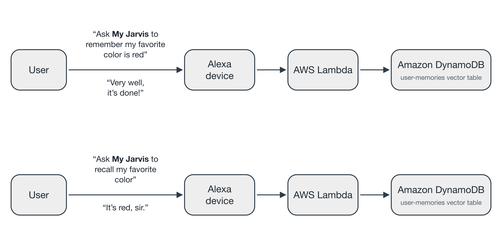
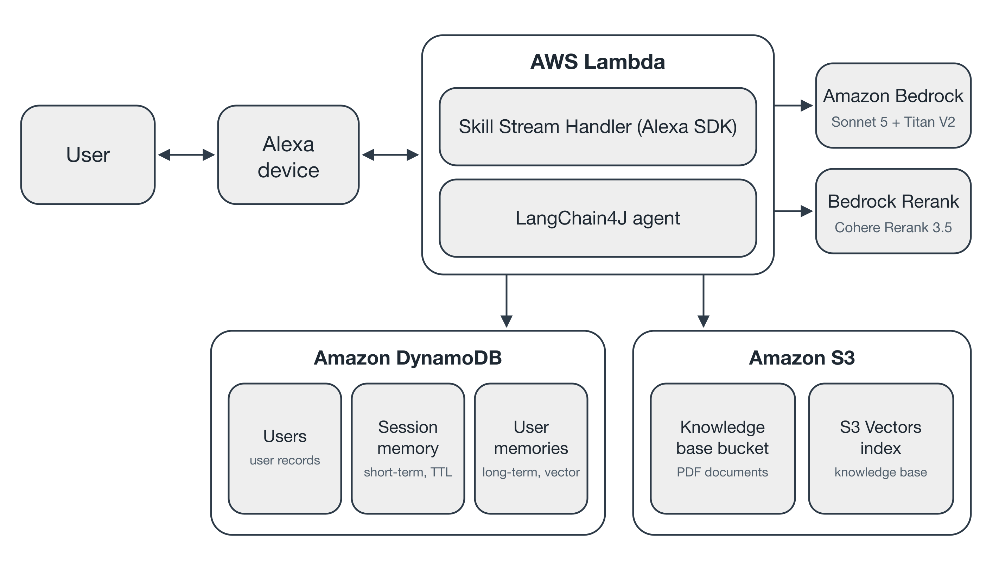
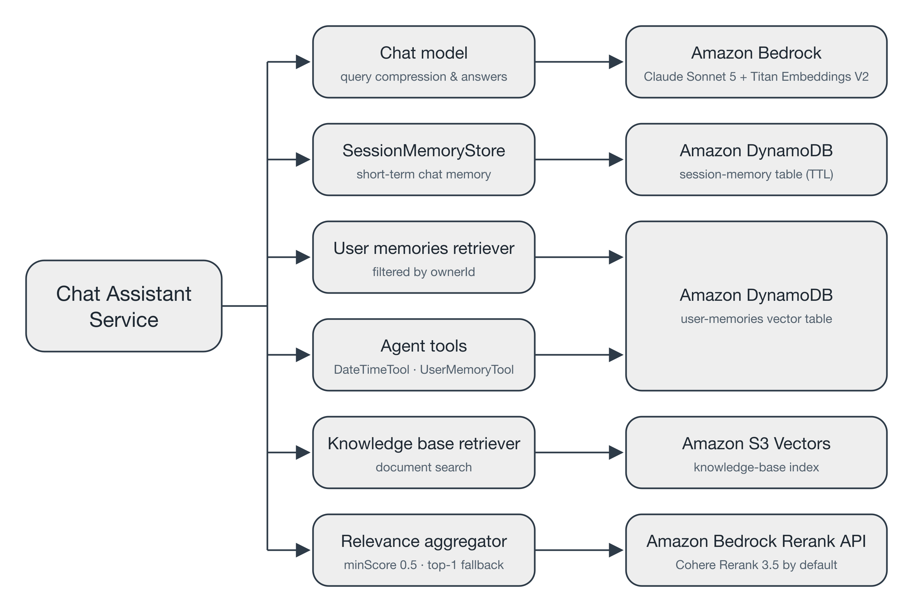

# Building my own J.A.R.V.I.S assistant

## Overview
This project demonstrates how to create a [J.A.R.V.I.S](https://en.wikipedia.org/wiki/J.A.R.V.I.S.) assistant deployed as an Alexa skill. Built using Java, LangChain4J, and AWS, it enables Alexa to recall past conversations and deliver contextual, intelligent responses. It showcases how to implement a memory layer for AI assistants, enriching the natural language experience through state persistence and fast retrieval.

## Table of Contents
- [Setup](#setup)
- [Testing the Assistant](#testing-the-assistant)
- [Cleaning Up Data](#cleaning-up-data)
- [Architecture](#architecture)
- [Known Issues](#known-issues)
- [Resources](#resources)
- [Maintainers](#maintainers)
- [License](#license)

## Setup

### Dependencies
- [Java 21+](https://www.oracle.com/java/technologies/downloads)
- [Maven 3.9+](https://maven.apache.org/install.html)
- [Terraform](https://developer.hashicorp.com/terraform/install)
- [AWS CLI](https://github.com/aws/aws-cli)
- [ASK CLI](https://github.com/alexa/ask-cli)
- [JQ](https://jqlang.org/)
- [SED](https://formulae.brew.sh/formula/gnu-sed)

### Account Requirements
| Account                                                  | Description                                                                  |
|:---------------------------------------------------------|:-----------------------------------------------------------------------------|
| [AWS account](https://aws.amazon.com/account)            | Required to create Lambda, IAM, and CloudWatch resources, and to call Amazon Bedrock. |
| [Amazon developer account](https://developer.amazon.com) | This is needed to register, deploy, and test Alexa skills.                   |

### Configuration

#### AWS Setup
1. Install the AWS CLI: [Installation Guide](https://docs.aws.amazon.com/cli/latest/userguide/getting-started-install.html)
2. Configure your credentials:
   ```sh
   aws configure
   ```

#### Amazon Developer Account
1. Install the ASK CLI: [Installation Guide](https://developer.amazon.com/en-US/docs/alexa/smapi/quick-start-alexa-skills-kit-command-line-interface.html)
2. Configure your credentials:
   ```sh
   ask configure
   ```

#### Terraform Configuration
1. Create your variables file:
   ```sh
   cp infrastructure/terraform.tfvars.example infrastructure/terraform.tfvars
   ```
2. Edit `infrastructure/terraform.tfvars` with your information:

| Variable                       | Description                                                                            |
|:-------------------------------|:---------------------------------------------------------------------------------------|
| `application_prefix`           | Prefix used for naming AWS resources (Lambda function, IAM role, artifacts bucket, etc.). |
| `bedrock_chat_model_id`        | Amazon Bedrock global inference profile for the chat model. Optional; defaults to `global.anthropic.claude-sonnet-5`. |
| `bedrock_chat_max_tokens`      | Maximum output tokens for the chat model. Optional; defaults to `4096`.                |
| `bedrock_rerank_model_id`      | Amazon Bedrock re-ranking model that re-ranks retrieved memories and knowledge-base content. Optional; defaults to `cohere.rerank-v3-5:0`. See [Re-ranking Model](#re-ranking-model). |
| `bedrock_rerank_region`        | AWS Region where the re-ranking model is invoked. Optional; defaults to the Region the Lambda is deployed to. See [Re-ranking Model](#re-ranking-model). |
| `knowledge_base_bucket_name`   | Name of the S3 bucket used to upload knowledge base documents.                         |
| `create_knowledge_base_bucket` | Whether Terraform creates the knowledge base bucket or uses an existing one. Optional; defaults to `true`. |
| `s3_vectors_bucket_name`       | S3 Vectors vector bucket that stores the knowledge base embeddings.                    |
| `s3_vectors_index_name`        | S3 Vectors index within the vector bucket. Optional; defaults to `knowledge-base`.     |
| `embedding_model_name`         | Amazon Bedrock embedding model for the knowledge base and user memories. Optional; defaults to `amazon.titan-embed-text-v2:0`. |
| `embedding_dimensions`         | Output dimensions of the embedding model, also used by both vector indexes. Optional; defaults to `1024`. |
| `dynamodb_users_table_name`    | DynamoDB table mapping each Alexa user to a spoken name (plain, non-vector).           |
| `dynamodb_session_memory_table_name` | DynamoDB table holding the short-term chat transcript per session (plain, TTL-expired). |
| `session_memory_ttl_minutes`   | Minutes a session-memory event lives before it expires. Optional; defaults to `5`.     |
| `session_memory_max_messages`  | Most recent session-memory messages replayed to the chat model per request. Optional; defaults to `20`. |
| `dynamodb_user_memory_table_name` | DynamoDB *vector* table storing every user's long-term memories (shared, isolated by ownerId). |
| `dynamodb_user_memory_index_name` | Vector index within the user-memory table. Optional; defaults to `user-memories`.  |

#### DynamoDB Setup
No manual steps are required. Terraform provisions the plain **users** and **session-memory** tables, and creates the long-term user-memory **vector** table by running the AWS CLI (the AWS provider has no resource for a DynamoDB vector table), so the AWS CLI must be installed and use the same credentials as Terraform. Set the table names via the `dynamodb_*_table_name` variables in your `terraform.tfvars`.

#### Knowledge Base Setup
Terraform provisions the S3 Vectors bucket and index. To add documents to the knowledge base, upload PDF files to the `ingest/` folder of the knowledge base bucket. An EventBridge rule invokes the Lambda every minute to embed new files into S3 Vectors, then moves each file to `processed/` on success or `failed/` on error.

#### Amazon Bedrock Model Access
The assistant calls three models on Amazon Bedrock: Claude Sonnet 5 for chat, Amazon Titan Text Embeddings V2 for embeddings, and Cohere Rerank 3.5 for re-ranking. Amazon models are available without any setup. Anthropic and Cohere models are sold through AWS Marketplace, so each one must be enabled once per AWS account before the Lambda can call it. Do this before your first request to the skill.

Amazon Bedrock enables a Marketplace model automatically the first time it is called, but only when the caller has the `aws-marketplace:Subscribe`, `aws-marketplace:Unsubscribe`, and `aws-marketplace:ViewSubscriptions` permissions. The Lambda's IAM role deliberately does not have them, so until a model is enabled, the Lambda's calls to it fail with a "Model access is denied" error that mentions these actions. Once a model is enabled, calling it needs no Marketplace permissions.

Before you start, make sure you have:
- An identity with the AWS managed policy `AmazonBedrockFullAccess`, or equivalent permissions. This policy grants the Bedrock model-access actions, and allows the three `aws-marketplace` actions only when Amazon Bedrock makes the call. Run the steps below with this identity, not with the Lambda's role.
- AWS CLI version 2.27.42 or later (`aws --version`).
- A valid payment method on the AWS account for AWS Marketplace purchases.
- If the account belongs to an AWS Organization, service control policies that allow AWS Marketplace subscriptions and use of these models. Otherwise, ask your administrator to enable them.

Enable each model with the values below. If you change `bedrock_chat_model_id`, use its foundation model ID, without the `global.` inference profile prefix. If you switch the re-ranking model to an Amazon model, skip it.

| Model             | `MODEL_ID`                  | `REGION`                                                        |
|:------------------|:----------------------------|:----------------------------------------------------------------|
| Claude Sonnet 5   | `anthropic.claude-sonnet-5` | The Region you deploy to                                        |
| Cohere Rerank 3.5 | `cohere.rerank-v3-5:0`      | `bedrock_rerank_region`, or the Region you deploy to if it is empty |

1. **Submit Anthropic's first-time use form (Claude only).** Anthropic requires use case details once per account, or once in the organization's management account, whose submission member accounts inherit. Opt-in Regions require it again. Open any Anthropic model in the model catalog of the Amazon Bedrock console and submit the form when prompted. Access is granted as soon as the form is submitted.

2. **Review the model's offer.** List its offer ID, pricing, and the URL of its license terms, and read the terms:
   ```sh
   REGION="<region>"
   MODEL_ID="<model-id>"
   aws bedrock list-foundation-model-agreement-offers --region "$REGION" --model-id "$MODEL_ID" --query 'offers[].{offerId: offerId, pricing: termDetails.usageBasedPricingTerm.rateCard, terms: termDetails.legalTerm.url}'
   ```

3. **Accept the offer, only if you agree with its terms.** Accepting it subscribes the account to the model and agrees to the model's end-user license agreement. Usage is then billed by AWS on behalf of the model provider at the listed prices. Set `OFFER_ID` to the offer ID you reviewed:
   ```sh
   OFFER_ID="<offer-id>"
   aws bedrock create-foundation-model-agreement --region "$REGION" --model-id "$MODEL_ID" --offer-token "$(aws bedrock list-foundation-model-agreement-offers --region "$REGION" --model-id "$MODEL_ID" --query "offers[?offerId=='$OFFER_ID'].offerToken | [0]" --output text)"
   ```

4. **Confirm that the model is ready.** It is ready when `agreementAvailability.status` is `AVAILABLE`, `authorizationStatus` is `AUTHORIZED`, and both `entitlementAvailability` and `regionAvailability` are `AVAILABLE`. The subscription can take several minutes to take effect, and until then the Lambda's calls may still fail with the same `aws-marketplace` error:
   ```sh
   aws bedrock get-foundation-model-availability --region "$REGION" --model-id "$MODEL_ID"
   ```

Subscriptions are billed per use only, and `./undeploy.sh` does not remove them. To remove one, run `aws bedrock delete-foundation-model-agreement --region "$REGION" --model-id "$MODEL_ID"`. See [Access Amazon Bedrock foundation models](https://docs.aws.amazon.com/bedrock/latest/userguide/model-access.html) for details.

#### Re-ranking Model
Re-ranking goes through the Amazon Bedrock Rerank API, which works with any re-ranking model Bedrock offers, so you can switch models by setting `bedrock_rerank_model_id`. Cohere Rerank 3.5 is the default because it is available in the most Regions. Amazon Rerank 1.0 (`amazon.rerank-v1:0`) is an alternative that needs no Marketplace subscription, but it is not available in `us-east-1`. Re-ranking models run only in-Region, without cross-Region inference:

| Model                                    | Regions                                                                  |
|:-----------------------------------------|:-------------------------------------------------------------------------|
| Cohere Rerank 3.5 (`cohere.rerank-v3-5:0`) | `us-east-1`, `us-west-2`, `ca-central-1`, `eu-central-1`, `ap-northeast-1` |
| Amazon Rerank 1.0 (`amazon.rerank-v1:0`)   | `us-west-2`, `ca-central-1`, `eu-central-1`, `ap-northeast-1`             |

If the model you choose is not available in the Region you deploy to, set `bedrock_rerank_region` to the nearest Region that offers it, for example `eu-central-1` when deploying to `eu-west-1`. The Lambda then calls the re-ranking model in that Region while every other resource stays in the Region you deploy to. Each re-ranking call then crosses Regions, which adds latency to every request that retrieves memories or knowledge-base content, and the query and retrieved content are processed in that Region. Check the [supported Regions](https://docs.aws.amazon.com/bedrock/latest/userguide/models-regions.html) before deploying, as the list may change.

Each re-ranking model scores relevance on its own scale. The assistant keeps only content scored at or above a minimum score (`minScore` in `ChatAssistantService`), so retune it after switching models.

#### Installation & Deployment
Once configured, deploy everything using:
```sh
./deploy.sh
```

When the deployment completes, note the Lambda ARN in the output values.

## Testing the Assistant

Once the deployment is complete, you can interact with your Alexa skill named **my jarvis**.



### 🗣️ Examples of interactions
- "Alexa, tell my jarvis to remember that my favorite programming language is Java."
- "Alexa, ask my jarvis to recall if Java is my favorite programming language."
- "Alexa, tell my jarvis to remember I have a doctor appointment next Monday at 10 AM."
- "Alexa, ask my jarvis to suggest what should I do for my birthday party."

### Teardown
To remove all deployed resources:
```sh
./undeploy.sh
```

## Cleaning Up Data

To start testing with a clean slate, erase the data the assistant has stored while keeping every resource deployed. Set the variables below to the values in your `infrastructure/terraform.tfvars`. The commands use the same AWS CLI credentials and region as Terraform.

```sh
USERS_TABLE="<dynamodb_users_table_name>"
SESSION_MEMORY_TABLE="<dynamodb_session_memory_table_name>"
USER_MEMORY_TABLE="<dynamodb_user_memory_table_name>"
VECTOR_BUCKET="<s3_vectors_bucket_name>"
VECTOR_INDEX="<s3_vectors_index_name>"
```

Erase the user records from the DynamoDB users table:
```sh
aws dynamodb scan --table-name "$USERS_TABLE" --projection-expression userId --query 'Items[].userId.S' --output text | tr '\t' '\n' | while read -r id; do
  aws dynamodb delete-item --table-name "$USERS_TABLE" --key "{\"userId\":{\"S\":\"$id\"}}"
done
```

Erase the short-term chat transcripts from the DynamoDB session-memory table:
```sh
aws dynamodb scan --table-name "$SESSION_MEMORY_TABLE" --projection-expression 'sessionId, eventId' --query 'Items[].[sessionId.S, eventId.S]' --output text | while read -r sid eid; do
  aws dynamodb delete-item --table-name "$SESSION_MEMORY_TABLE" --key "{\"sessionId\":{\"S\":\"$sid\"},\"eventId\":{\"S\":\"$eid\"}}"
done
```

Erase the long-term user memories from the DynamoDB vector table:
```sh
aws dynamodb scan --table-name "$USER_MEMORY_TABLE" --projection-expression id --query 'Items[].id.S' --output text | tr '\t' '\n' | while read -r id; do
  aws dynamodb delete-item --table-name "$USER_MEMORY_TABLE" --key "{\"id\":{\"S\":\"$id\"}}"
done
```

Erase the knowledge base embeddings from the S3 Vectors index:
```sh
aws s3vectors list-vectors --vector-bucket-name "$VECTOR_BUCKET" --index-name "$VECTOR_INDEX" --query 'vectors[].key' --output text | tr '\t' '\n' | xargs -r -n 500 aws s3vectors delete-vectors --vector-bucket-name "$VECTOR_BUCKET" --index-name "$VECTOR_INDEX" --keys
```

Verify that every store is empty. Each command should print `0`:
```sh
for table in "$USERS_TABLE" "$SESSION_MEMORY_TABLE" "$USER_MEMORY_TABLE"; do
  aws dynamodb scan --table-name "$table" --select COUNT --query Count --output text
done
aws s3vectors list-vectors --vector-bucket-name "$VECTOR_BUCKET" --index-name "$VECTOR_INDEX" --query 'length(vectors)' --output text
```

On the next request, the assistant creates your user record again from your Alexa profile. The source documents of the knowledge base remain in the `processed/` folder of the knowledge base bucket; to embed them again, move them back to the `ingest/` folder.

## Architecture

This architecture uses an Alexa skill written in Java and hosted as an AWS Lambda function. The Lambda implements a stream handler that processes user requests and responses, using DynamoDB (plain tables for user records and short-term session memory, plus a vector table for long-term user memories) as its backend layer.


As part of the stream handler implementation, it uses a Chat Assistant Service that leverages LangChain4J to manage interactions with the memory stores. This service implements context engineering, ensuring that conversations are enriched with relevant user memories retrieved from DynamoDB and knowledge-base content retrieved from S3 Vectors, re-ranked through the Amazon Bedrock Rerank API (Cohere Rerank 3.5 by default) so only the relevant results reach the prompt. Claude Sonnet 5 on Amazon Bedrock is the LLM used to process and generate responses, and Amazon Titan Text Embeddings V2 on Amazon Bedrock generates the embeddings for the knowledge base and user memories.

## Known Issues
- Alexa Developer Console may require manual linking if credentials are not fully synchronized.

## Resources
- [Amazon DynamoDB](https://docs.aws.amazon.com/dynamodb/)
- [Amazon S3 Vectors](https://docs.aws.amazon.com/AmazonS3/latest/userguide/s3-vectors.html)
- [Amazon Bedrock](https://docs.aws.amazon.com/bedrock/)
- [LangChain4J](https://docs.langchain4j.dev)
- [Amazon Bedrock Rerank API](https://docs.aws.amazon.com/bedrock/latest/userguide/rerank.html)
- [AWS Lambda Documentation](https://docs.aws.amazon.com/lambda)
- [Amazon Alexa Skills Kit](https://developer.amazon.com/en-US/alexa/alexa-skills-kit)

## Maintainers
**Maintainers:**
- Ricardo Ferreira — [@riferrei](https://github.com/riferrei)

## License
This project is licensed under the [MIT License](./LICENSE).
